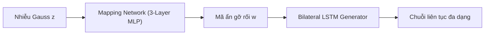

### User Input

có cải tiến nào trong kiến trúc có thể giúp mô hình không bị mode collapse ở dữ liệu liên tục không?

### Planner Response

Hiện tượng **Mode Collapse đối với dữ liệu liên tục** (như các tín hiệu sinh tồn nhịp tim, huyết áp chuỗi thời gian) là một bài toán rất kinh điển và khó trong GAN. Dữ liệu liên tục có phân phối cực kỳ phức tạp, có tính **đa phương thức (multi-modal)** và phụ thuộc chặt chẽ vào thời gian, khác hoàn toàn với dữ liệu rời rạc (chỉ gồm các nhãn 0/1). 

Nếu chỉ sử dụng cấu trúc mạng LSTM cơ bản như hiện tại, Generator rất dễ bị "quá tải" khi cố gắng ánh xạ từ nhiễu Gauss đơn giản sang không gian chuỗi liên tục phức tạp.

Dưới đây là **3 cải tiến đột phá về mặt kiến trúc** được chứng minh hiệu quả nhất trong các nghiên cứu GAN chuỗi thời gian hiện đại để ngăn chặn Mode Collapse:

---

### 1. Thêm Mạng Ánh Xạ Mã Ẩn (MLP Mapping Network) cho Generator
> [!NOTE]
> *Ý tưởng này được kế thừa trực tiếp từ kiến trúc **StyleGAN** danh tiếng.*

*   **Hạn chế hiện tại:** Bạn đang đưa nhiễu ngẫu nhiên $z$ (phân phối Gauss tiêu chuẩn $N(0, I)$) trực tiếp vào LSTM của Generator tại mỗi bước thời gian. Việc ép LSTM phải ánh xạ trực tiếp từ một không gian Gauss cực kỳ đơn giản và đối xứng sang các đường cong sinh tồn phi tuyến tính phức tạp làm cho Generator bị "nghẽn cổ chai", dẫn đến việc nó chỉ chọn cách sinh ra một dạng đường cong trung bình và an toàn nhất (Mode Collapse).
*   **Kiến trúc cải tiến:** Trước khi đưa nhiễu $z$ vào LSTM, ta cho nó đi qua một mạng **Mapping Network** (gồm 3-4 lớp Tuyến tính + LeakyReLU):
    $$z \in \mathbb{R}^{\text{noise\_dim}} \xrightarrow{\text{Mapping Network}} w \in \mathbb{R}^{\text{noise\_dim}}$$
    Mã ẩn trung gian $w$ này sau đó mới được đưa vào LSTM của Generator.
*   **Tại sao giúp chống Mode Collapse?** Mạng Mapping Network sẽ chịu trách nhiệm "uốn cong" và "gỡ rối" (disentangle) không gian Gauss ban đầu thành một không gian mã ẩn trung gian $w$ phi tuyến tính. Lúc này, LSTM không còn phải làm nhiệm vụ ánh xạ phức tạp nữa, nó chỉ việc dịch mã ẩn $w$ đã được phân tách rõ ràng thành chuỗi thời gian đa dạng.

---

### 2. Nâng cấp lên Multi-Head Self-Attention (MHSA)
*   **Hạn chế hiện tại:** Lớp `TemporalSelfAttention` hiện tại trong code chỉ sử dụng **1 đầu chú ý (single-head)**. Đối với các tín hiệu sinh tồn liên tục, chuỗi thời gian chứa nhiều mối tương quan đồng thời: tương quan ngắn hạn (tần số thở thay đổi nhanh), tương quan trung hạn (xu hướng sốt theo giờ), và tương quan dài hạn (chu kỳ sinh học 24h). Một đầu chú ý đơn lẻ chỉ có thể tập trung vào một mối tương quan mạnh nhất, làm Generator mất đi khả năng sinh ra các đặc trưng có tần số biến đổi khác nhau.
*   **Kiến trúc cải tiến:** Thay thế `TemporalSelfAttention` bằng **Multi-Head Self-Attention (MHSA)** (ví dụ: dùng 4 hoặc 8 đầu chú ý chạy song song, giống như trong kiến trúc Transformer).
*   **Tại sao giúp chống Mode Collapse?** Mỗi "đầu chú ý" (Head) sẽ tự động đảm nhận việc học một góc độ tương quan thời gian khác nhau (ví dụ: Head 1 học về biến động nhanh, Head 2 học về xu hướng chậm). Điều này cho phép Generator bao quát được toàn bộ các chế độ phân phối (modes) của dữ liệu liên tục từ thô đến mịn, ngăn chặn việc mô hình bị kẹt vào một chế độ duy nhất.

---

### 3. Tích hợp Residual Skip Connection (Kết nối tắt) vào các tầng LSTM
*   **Hạn chế hiện tại:** Cả `BilateralGenerator` và `SequenceDiscriminator` đều đang dùng LSTM xếp chồng 3 lớp (`num_layers=3`) nhưng không có kết nối tắt. Trong huấn luyện GAN, các tín hiệu gradient từ Discriminator truyền ngược về Generator qua 3 lớp tuần hoàn rất dễ bị hiện tượng **triệt tiêu gradient (vanishing gradients)**. Khi gradient bị triệt tiêu, các tầng LSTM đầu tiên của Generator sẽ ngừng học và chỉ cho ra một đầu ra tĩnh, dẫn đến sụp đổ chế độ chuỗi.
*   **Kiến trúc cải tiến:** Thay thế LSTM xếp chồng thông thường bằng **ResLSTM** (hoặc tự code thêm skip connection thủ công giữa các tầng LSTM). Đầu ra của tầng LSTM thứ $l$ sẽ được cộng trực tiếp vào đầu ra của tầng LSTM thứ $l+1$:
    $$h_{t}^{(l+1)} = \text{LSTMCell}(h_{t-1}^{(l+1)}, h_{t}^{(l)}) + h_{t}^{(l)}$$
*   **Tại sao giúp chống Mode Collapse?** Kết nối tắt tạo ra một "xa lộ thông tin" cho phép gradient từ Discriminator truyền thẳng xuống các tầng dưới cùng của Generator mà không bị suy hao qua thời gian và độ sâu. Nhờ đó, tất cả các tham số của Generator đều được cập nhật mạnh mẽ và liên tục duy trì tính đa dạng.

---

### 💡 Gợi ý thực hiện:
Nếu bạn muốn bắt tay vào thử nghiệm cải tiến kiến trúc, **Cải tiến số 1 (Mapping Network)** là phương án **dễ code nhất** (chỉ mất khoảng 10 dòng code trong `networks.py`) nhưng lại mang lại **hiệu quả đột phá nhất** để giải quyết Mode Collapse cho dữ liệu liên tục trong các mô hình GAN chuỗi thời gian. 

Bạn có muốn tôi phác thảo nhanh đoạn mã Python để tích hợp lớp **Mapping Network** này vào cấu trúc `JointGenerator` hiện tại của bạn để bạn tham khảo không?